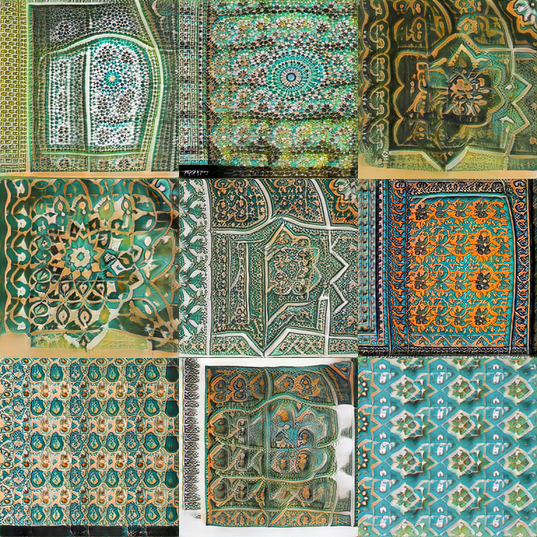

# gan-mosaics

The models were trained using a Stylegan2-Ada model for two days.

## Colab Notebook 
You can use this notebook to traversing and interpolation. 

## Size-256
### Generated Images

### Time Elapse
