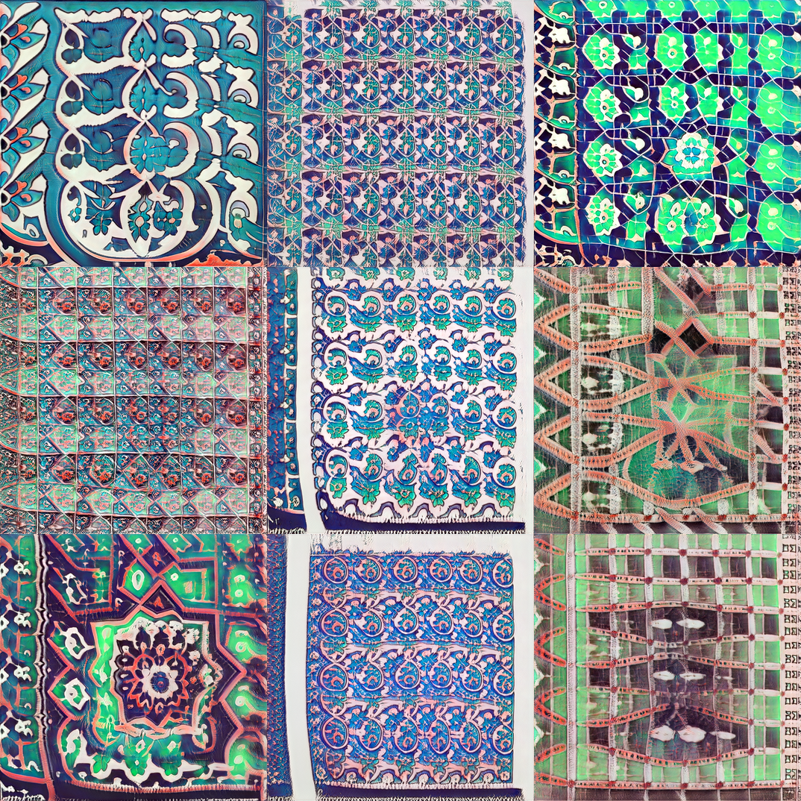

# gan-mosaics

The models were trained using a Stylegan2-Ada model for two days. You can run the notebook in colab 
You can use this notebook to traversing and interpolation. Note that a big portion of the code is from [Hephyrius](https://github.com/Hephyrius/Stylegan2-Ada-Google-Colab-Starter-Notebook/) impelementation. 

### Generated Images

### Time Elapse
